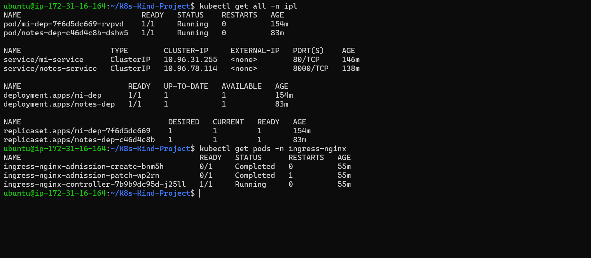
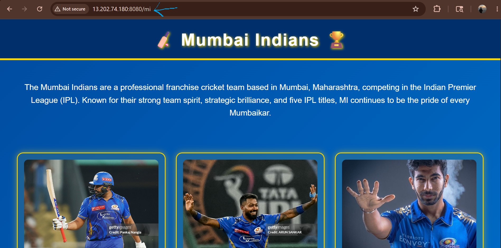
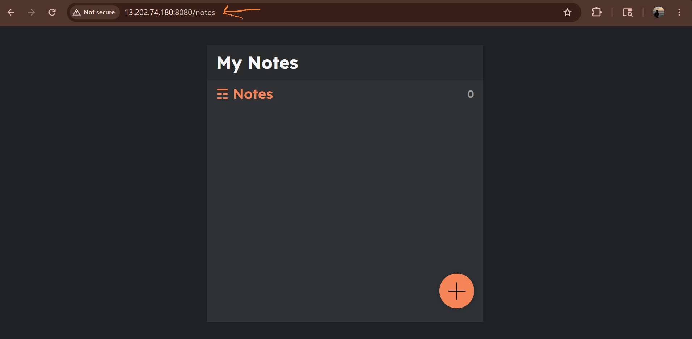

# Kubernetes Ingress Controller Project using Kind Cluster

## Project Overview

This project demonstrates deployment and management of multiple applications inside a Kubernetes Kind cluster with NGINX Ingress Controller integration.

The infrastructure was provisioned using Terraform, while Kubernetes resources were managed using YAML manifests.

The project includes:

- Persistent Volumes (PV)
- Persistent Volume Claims (PVC)
- Deployments
- Services
- NGINX Ingress Controller
- Multi-application routing

Applications deployed:

- Mumbai Indians Web Page
- Notes Application

---

# Technology Stack

## Cloud & Infrastructure
- Terraform
- AWS
- Linux

## Container & Orchestration
- Docker
- Kubernetes
- Kind Cluster

## Kubernetes Components
- Deployments
- Services
- Persistent Volumes
- Persistent Volume Claims
- Ingress Controller

---

Implementation Workflow
1. Infrastructure Provisioning
Terraform Automation
Provisioned infrastructure using Terraform
Managed infrastructure using Infrastructure as Code principles
Automated environment setup
2. Kubernetes Cluster Setup
Kind Cluster Configuration
Created Kubernetes cluster using Kind
Configured cluster networking
Verified cluster and node status
3. Persistent Storage Configuration
Persistent Volume (PV)
Configured storage resources inside Kubernetes
Provided persistent storage for applications
Persistent Volume Claim (PVC)
Requested storage from Persistent Volumes
Attached storage to application pods
4. Application Deployment
Mumbai Indians Web Page
Deployed using Kubernetes Deployment
Exposed internally using Kubernetes Service
Notes Application
Deployed inside the same Kubernetes cluster
Managed independently using Kubernetes resources
5. Kubernetes Networking
Services
Exposed applications internally inside the cluster
Enabled communication between pods and ingress controller
NGINX Ingress Controller
Configured routing for multiple applications
Exposed both applications using a single public IP
Managed external traffic routing
Key Features
Multi-application deployment in Kubernetes
Persistent storage implementation using PV and PVC
Ingress-based routing architecture
Infrastructure provisioning using Terraform
Kubernetes networking and service exposure
Kind cluster implementation for orchestration practice
Learning Outcomes
Through this project, I gained practical experience in:
Kubernetes cluster management
Persistent storage concepts in Kubernetes
Deployments and Services
Ingress Controller implementation
Multi-application routing
Terraform-based infrastructure provisioning
Kubernetes networking concepts

## Screenshots
<h2>Pods Services </h2>



<h2>Mumbai Indians Web Page</h2>



<h2>Notes Application</h2>



# Project Architecture

```text
                        User Browser
                              |
                              v
                     Public IP Address
                              |
                              v
                 NGINX Ingress Controller
                              |
          +-----------------------------------+
          |                                   |
          v                                   v
     Mumbai Indians Web Page          Notes Application
          |                                   |
          v                                   v
      Kubernetes Service               Kubernetes Service
          |                                   |
          v                                   v
      Kubernetes Pods                  Kubernetes Pods
          |                                   |
          +---------------+-------------------+
                          |
                          v
                    PV and PVC Storage
